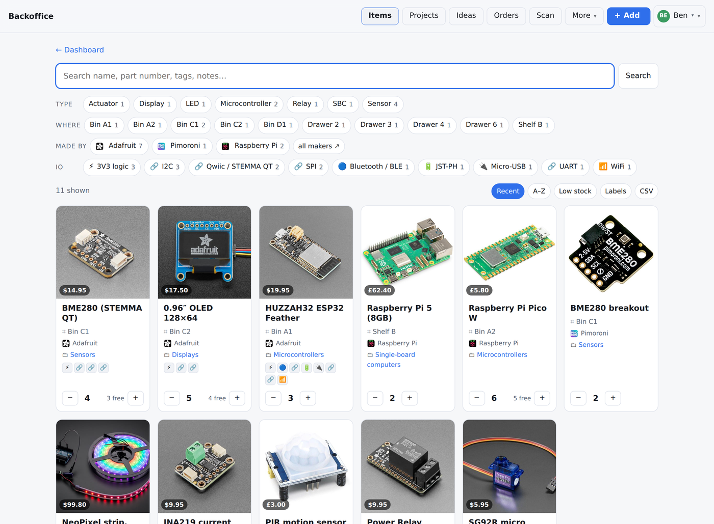
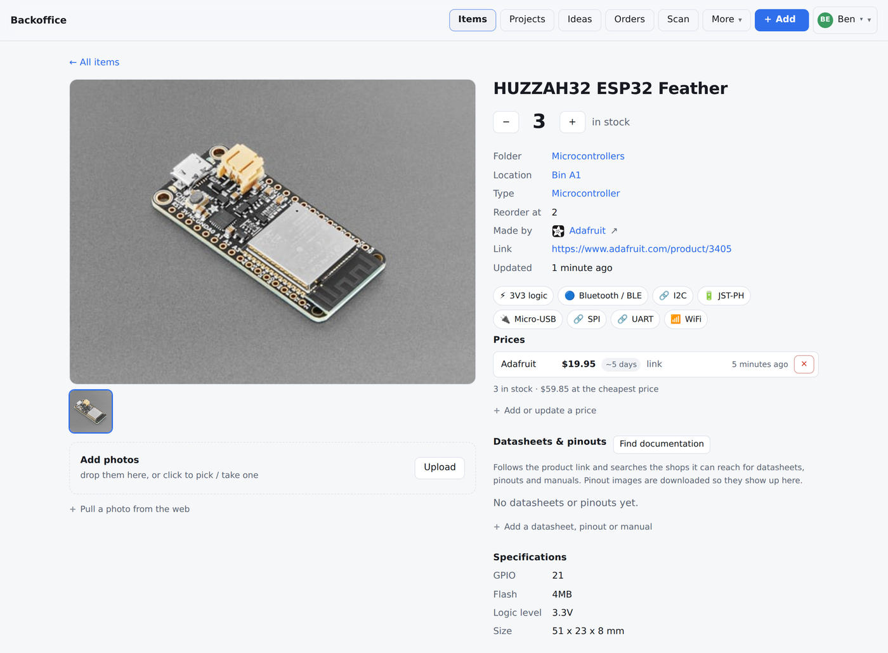
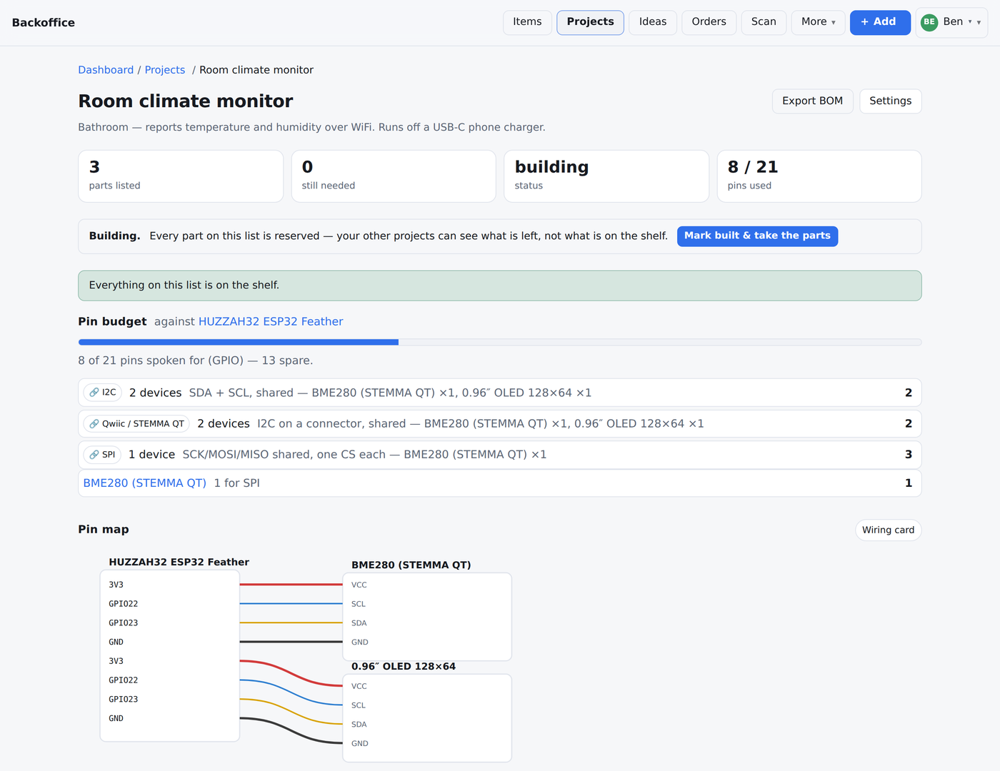
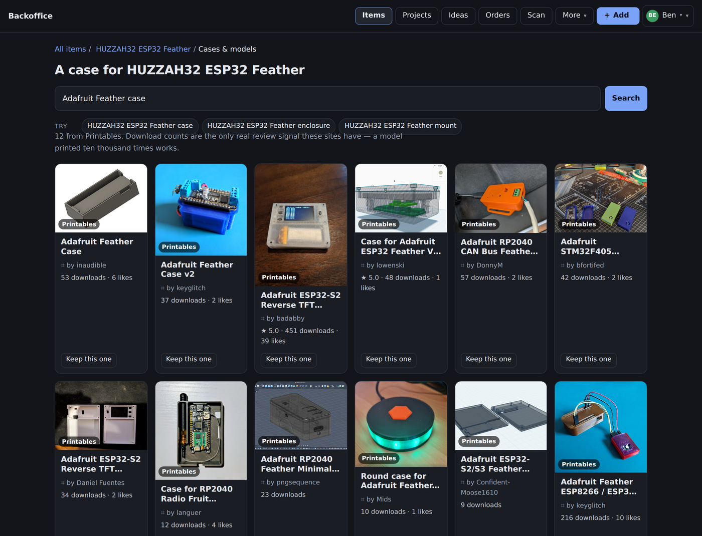
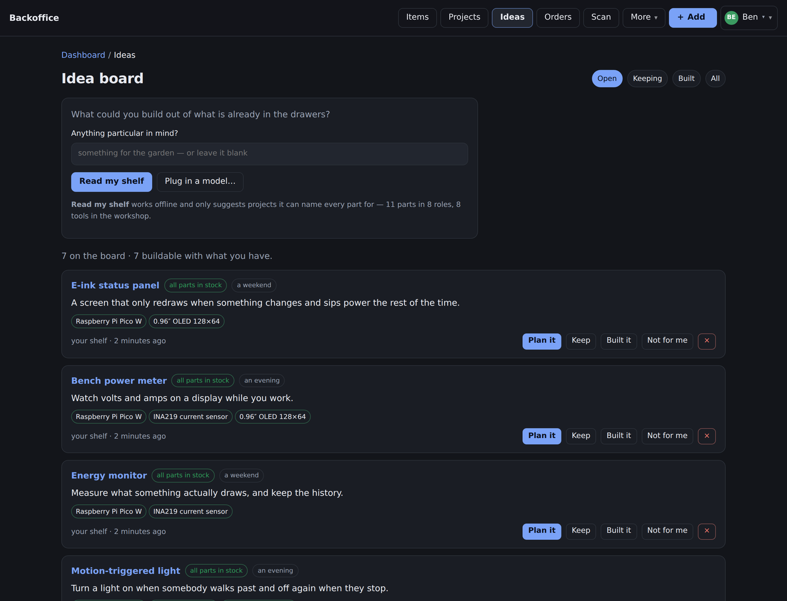

# Backoffice

I kept buying the same BME280 three times because I couldn't remember which
drawer the last one went in. So I wrote an inventory for my parts shelf.

It turned into more than that. It knows what tools I own, so it can tell me
whether to print a case or buy one. It reads my shelf and suggests projects I
can actually build tonight. It draws the wiring.

One Go binary, one SQLite file, one folder of photos. No database server, no
`npm install`, no config file.



## Running it

```sh
go build -o backoffice ./cmd/backoffice
./backoffice          # http://localhost:8080, data in ./data
```

Or `docker compose up -d`.

For a Pi or any other ARM box, build it anywhere and copy the binary over — it
has no runtime dependencies, not even libc:

```sh
GOOS=linux GOARCH=arm64 CGO_ENABLED=0 go build -o backoffice ./cmd/backoffice
```

Upgrading is replacing the binary. The database migrates itself on startup.

## What it does

**Parts.** Photos, counts, locations, folders, tags. Paste a product link from
Adafruit, Pimoroni or The Pi Hut and it fills in the name, photo, price and
part number by itself. Search is instant and filters stack.



**Prices and orders.** Price per shop with history, so you can see when
something got more expensive. Orders track what's on its way and learn each
shop's real delivery time from how long past orders actually took.

**Projects.** A parts list that tells you what you're missing. Marking one
*building* reserves its parts, so the rest of the app shows what's free rather
than what's on the shelf. Import a BOM from KiCad or EasyEDA and it matches
lines against parts you already own.

**Wiring.** Record which pin goes where and it draws it. Colours follow bench
convention — red power, black ground, dashed interrupts — so the picture and
the wire in your hand agree. The pin budget counts whether the board you picked
has enough legs, and catches the same pin used twice.



**Labels.** QR codes and barcodes, printed to a sheet. Scanning one with a
phone opens that part's page with the count buttons under your thumb.

**Cases.** Search Printables for an enclosure, keep the good ones against the
part. Give it the STL and it parses the mesh, measures the real bounding box
and renders a preview, so you know whether it fits before a six-hour print.



## The workshop, and the idea board

These two are the parts I actually use most.

The **workshop** is a list of your tools. You don't fill in a form forty times —
you paste whatever list you already have and it sorts it out:

```
3D printing:
Prusa MK4 (250x210x220)

Soldering:
soldering iron — hakko fx888d
hot air rework station

digital calipers
Rigol DS1054Z oscilloscope - 50MHz
2x wire strippers
```

Bullets and numbering come off. A heading applies until a blank line. A size in
brackets becomes a detail, a model number stays in the name. `2x` is a note, not
two rows. Anything it doesn't recognise is kept anyway rather than dropped. Then
it shows you the table so you can fix what it got wrong — nothing saves until
you say so.

What matters isn't the tool names, it's what they add up to: *can print up to
250 × 210 × 220 mm*, *can solder surface-mount*, *can measure accurately*.

The **idea board** uses that. It sorts your parts into roles — controller,
sensor, display, actuator — and matches them against project recipes. It only
suggests things it can name every part for, so it offers fewer ideas than you
might expect and none of them are imaginary.



Then it tells you how to get it in a box, which depends on your tools. Printer
and calipers: print it, here's your bed size, measure the boards first. No
printer: buy a project box and cut it. No tools at all: look for a case sold for
the board itself.

My favourite bit is small. A Raspberry Pi has no analogue input, so if it pairs
a Pi with a TMP35 it adds an ADC to the parts list — ticked off if you own an
MCP3008, on the shopping list if you don't. An ESP32 doesn't get that line,
because it doesn't need one.

## Optional: plug in a model

The idea board works offline with no model at all. If you want one anyway,
Settings → Model takes three shapes:

| Kind | Endpoint | Key |
|---|---|---|
| Ollama | `{base}/api/chat` | none |
| OpenAI-compatible | `{base}/chat/completions` | `Authorization: Bearer` |
| Anthropic | `{base}/v1/messages` | `x-api-key` |

The middle one covers OpenAI, Kimi, OpenRouter and LM Studio. There's a Test
button that makes a real request and tells you what came back, because "saved"
isn't the same as "works".

Whatever it suggests gets checked against your actual inventory before you see
it — if it claims you have a part you don't, that part goes on the shopping
list regardless of what it said.

Keys are stored in the database so they survive a restart. They're never
rendered back into a page, never logged, never in a CSV export. They *are* in
the backup file, so treat backups as secrets.

## Configuration

All optional. The defaults are the intended setup.

| Variable | Default | What it does |
| --- | --- | --- |
| `PORT` | `8080` | Port to listen on. |
| `DATA_DIR` | `./data` | Where the database and photos live. |
| `AUTH_PASSWORD` | *(unset)* | If set, the app requires this password. If unset, no login. |
| `SITE_TITLE` | `Backoffice` | Name in the header. |
| `BASE_URL` | *(request host)* | Public address printed into QR labels. Set this behind a proxy. |
| `SHOPIFY_SHOPS` | `thepihut.com,shop.pimoroni.com` | Shops to search. `none` disables them. |
| `NEXAR_CLIENT_ID` / `NEXAR_CLIENT_SECRET` | *(unset)* | Octopart credentials, for part specs and distributor stock. |
| `THINGIVERSE_TOKEN` | *(unset)* | Free token to also search Thingiverse. Printables needs nothing. |
| `ALLOW_PRIVATE_FETCH` | *(unset)* | Let link imports reach LAN addresses. Off by default on purpose. |
| `TZ` | `UTC` | Affects the "updated 3 hours ago" timestamps. |

Named accounts are optional too — add them from Health & backup and the shared
password turns into per-person logins with an activity log.

## How it's built

About 19k lines of Go and 6.7k of tests. Two real dependencies:
`modernc.org/sqlite` (pure Go, so `CGO_ENABLED=0` works) and `golang.org/x/image`
for the formats the standard library won't decode.

Some things I wrote myself rather than pulling in a library:

- **KiCad footprints.** An s-expression parser and an SVG renderer, so a
  footprint name turns into pads drawn to scale.
- **STL meshes.** Binary and ASCII, with a z-buffer rasteriser for the preview.
  The file length decides which format it is, not the leading word — plenty of
  binary exporters write "solid" into the header.
- **Labels.** QR and barcode sheets laid out for a printer.
- **Wiring diagrams.** SVG straight out of the pin map.

Everything works without JavaScript except three things that can't: camera
scanning, search-as-you-type, and drag-and-drop import.

### Gotchas I hit

`db.SetMaxOpenConns(1)` means a transaction holds the only connection. Anything
a transaction needs has to be read *before* `Begin()`. I deadlocked the app
twice learning that, which is why there's a comment about it next to the line.

Photos are content-addressed by hash, so the same image added twice is stored
once. Case thumbnails from Printables are cached to disk instead of being
re-fetched every page load.

Link imports refuse to dial private addresses, checked per redirect hop against
the IP actually being dialled rather than the hostname. The one exception is an
AI endpoint you typed yourself, because that's usually `localhost`.

## Development

```sh
go test ./...          # 186 tests
go test -race ./...
go vet ./...
```

Templates, CSS and JS are embedded with `embed.FS`, so the binary is the whole
app. Schema changes are a new entry in the migration list in `migrate.go`,
keyed on `PRAGMA user_version`; old data directories upgrade themselves.
